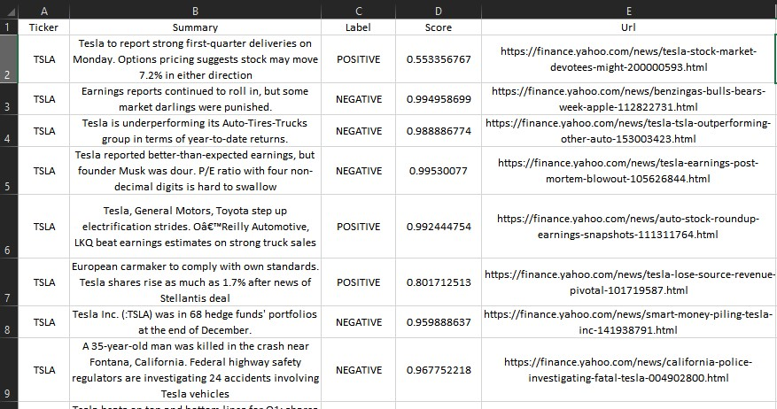

### Get Asset Sentiment
Automatically fetches top 10 news article of your tickers.
1. Scrape those article
2. Summarizes them
3. Find Sentiment
4. Export the data as csv

Could be used to find overall mood of the market and can also be fed into other machine learning models for stock price prediction.

### Example Output
